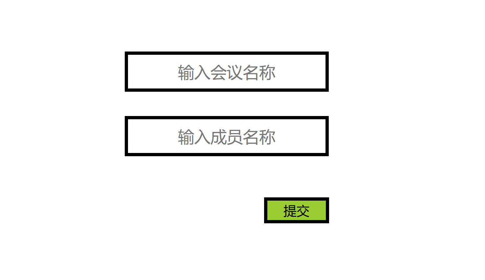
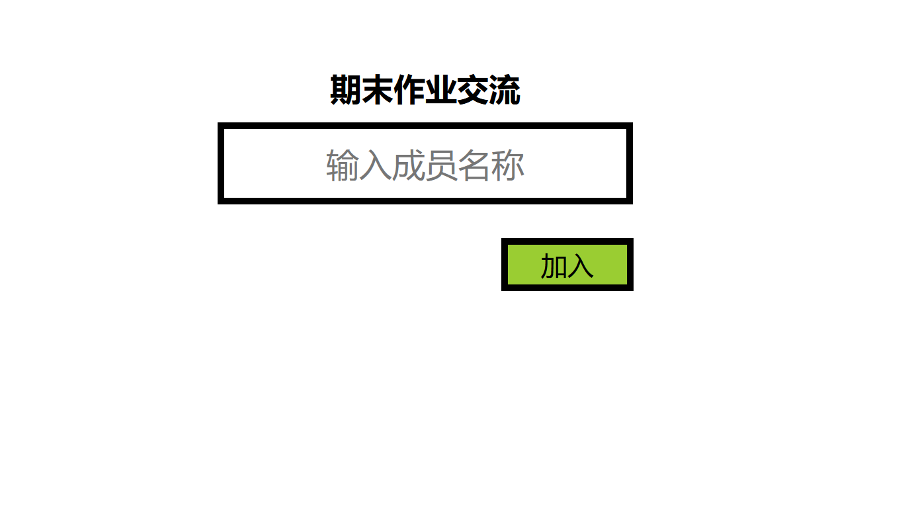
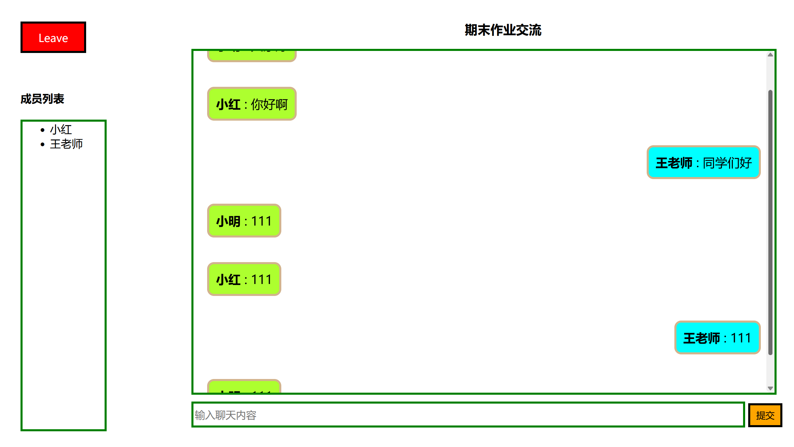

### Web前端开发技术 - 期末大作业
#### 项目目录如下
```
.
├── __pycache__
│   └── app.cpython-311.pyc
├── app.py
├── static
│   ├── initial.css
│   ├── join.css
│   └── meeting.css
└── templates
    ├── initial.html
    ├── join.html
    └── meeting.html
```
#### html源代码
新建会议界面 meeting.html
```
<!DOCTYPE html>
<html lang="en">
<head>
    <meta charset="UTF-8">
    <meta http-equiv="X-UA-Compatible" content="IE=edge">
    <meta name="viewport" content="width=device-width, initial-scale=1.0">
    <title>新建会议</title>
    <link rel="stylesheet" href="{{ url_for('static', filename='initial.css') }}" type="text/css">
</head>
<body>
    <form class="initial" action="{{ url_for('submitForm') }}" method="post">
        <input type="text" class="initial" name="meeting-name" placeholder="输入会议名称"><br>
        <input type="text" class="initial" name="member-name" placeholder="输入成员名称"><br>
        <button class="initial">提交</button>
    </form>
</body>
</html>
```
效果如下:

成员加入会议界面 join.html
```
<!DOCTYPE html>
<html lang="en">
<head>
    <meta charset="UTF-8">
    <meta name="viewport" content="width=device-width, initial-scale=1.0">
    <title>加入会议</title>
    <link rel="stylesheet" href="{{ url_for('static', filename='join.css') }}" type="text/css">
</head>
<body>
    <h2 class="join">{{ meetingName }}</h2>
    <form class="join" action="{{ url_for('join', tempUuid=tempUuid) }}" method="post">
        <input type="text" class="join" name="member-name" placeholder="输入成员名称"><br>
        <button type="submit" class="join" value="">加入</button>
    </form>
</body>
</html>
```
效果如下:

会议聊天界面 meeting.html
```
<!DOCTYPE html>
<html lang="en">
<head>
    <meta charset="UTF-8">
    <meta name="viewport" content="width=device-width, initial-scale=1.0">
    <link rel="stylesheet" href="{{ url_for('static', filename='meeting.css') }}" type="text/css">
    <title>会议室</title>
</head>
<body>
    <div>
        <a href="{{ url_for('leave', id=tempUuid) }}" class="meeting">Leave</a>
        <div class="member-list">
            <h4>成员列表</h4>
            <ul>
                
                <li>{{ member }}</li>
                
            </ul>
        </div>
        <h3 class="chat-content">{{ meetingName }}</h3>
        <div class="chat-content">
            
                
                    
                        <p class="self"><strong>{{mes[0]}}</strong> : {{ mes[1] }}</p>
                    
                        <p class="other"><strong>{{mes[0]}}</strong> : {{ mes[1] }}</p>
                    
                
            
        </div>
        <form action="{{ url_for('chat', id=tempUuid) }}" method="post" class="chat-content">
            <input type="text" name="mes" placeholder="输入聊天内容" class="chat-content" required>
            <button class="chat-content" type="submit">提交</button>
        </form>
    </div>
</body>
</html>
```
效果如下:

#### css代码
initial.css
```
form.initial {
    margin: auto;
    text-align: center;
    margin-top: 10%;
}

input.initial {
    margin-top: 3%;
    border: 5px solid black;
    width: 300px;
    height: 50px;
    font-size: 25px;
    text-align: center;
}

button.initial {
    border: 5px solid black;
    margin-top: 5%;
    margin-left: 17%;
    background-color: yellowgreen;
    width: 100px;
    height: 40px;
    font-size: 20px;
}
```
join.css
```
h2.join {
    margin: auto;
    text-align: center;
    margin-top: 100px;
}

input.join {
    border: 5px solid black;
    width: 300px;
    height: 50px;
    font-size: 25px;
    text-align: center;
    margin-top: 10px;
}

form.join {
    margin: auto;
    text-align: center;
}

button.join {
    border: 5px solid black;
    margin-top: 2%;
    margin-left: 17%;
    background-color: yellowgreen;
    width: 100px;
    height: 40px;
    font-size: 20px;
}
```
meeting.css
```
a.meeting {
    position: absolute;
    left: 100px;
    top: 60px;
    text-decoration: none;
    text-align: center;
    border: 3px solid black;
    width: 90px;
    height: 30px;
    padding-top: 10px;
    color: white;
    background-color: red;
}

div.member-list {
    position: absolute;
    left: 100px;
    top: 140px;
}

div.member-list ul{
    border: 3px solid green;
    width: 80px;
    height: 450px;
}

h3.chat-content {
    position: absolute;
    top: 40px;
    left: 750px;
}

div.chat-content {
    position: absolute;
    top: 100px;
    left: 350px;
    border: 3px solid green;
    width: 850px;
    height: 500px;
    overflow: auto;
}

form.chat-content {
    position: absolute;
    bottom: 60px;
    left: 350px;
}

input.chat-content {
    width: 800px;
    height: 30px;
    border: 3px solid green;
    font-size: 15px;
}

button.chat-content {
    border: 3px solid black;
    height: 35px;
    width: 50px;
    background-color: orange;
}

p.self {
    float: right;
    margin-right: 20px;
    clear: both;
    border: 3px solid tan;
    border-radius: 10px;
    padding: 10px;
    font-size: 18px;
    background-color: aqua;
}

p.other {
    float: left;
    clear: both;
    margin-left: 20px;
    border: 3px solid tan;
    border-radius: 10px;
    padding: 10px;
    font-size: 18px;
    background-color: greenyellow;
}
```
#### python代码
<span>app.py<span>
```
from flask import Flask, render_template, url_for, request, redirect, make_response
import uuid

app = Flask(__name__)

meetings = {}
messages = {}

@app.route('/', methods=['GET'])
def initial():
    return render_template('initial.html')

@app.route('/submit', methods=['POST'])
def submitForm():
    tempUuid = str(uuid.uuid4())
    meetingName = request.form.get('meeting-name')
    memberName = request.form.get('member-name')
    meetings.update({tempUuid: [meetingName, memberName]})
    res = make_response(redirect(url_for('join', tempUuid=tempUuid)))
    res.set_cookie(tempUuid, memberName)
    return res

@app.route('/<tempUuid>', methods=['GET', 'POST'])
def join(tempUuid):
    if request.method == 'GET':
        if tempUuid not in meetings.keys():
            return redirect(url_for('initial'))

        elif request.cookies.get(tempUuid) is None:
            meetingName = meetings.get(tempUuid)[0]
            return render_template('join.html', tempUuid=tempUuid, meetingName=meetingName)

        else:
            if request.cookies.get(tempUuid) not in meetings.get(tempUuid):
                meetings.get(tempUuid).append(request.cookies.get(tempUuid))
            memberName = request.cookies.get(tempUuid)
            meetingName = meetings.get(tempUuid)[0]
            meetingMember = meetings.get(tempUuid)[1:]
            message = messages.get(tempUuid)
            return render_template('meeting.html', meetingName=meetingName, meetingMember=meetingMember, 
                                   message=message, tempUuid=tempUuid, memberName=memberName)
    
    else:
        memberName = request.form.get('member-name')
        meetings[tempUuid].append(memberName)
        res = make_response(redirect(url_for('join', tempUuid=tempUuid)))
        res.set_cookie(tempUuid, memberName)
        return res

@app.route('/chat', methods=['POST'])
def chat():
    tempUuid = request.args.get('id')
    message = request.form.get('mes')
    username = request.cookies.get(tempUuid)
    if messages.get(tempUuid) is None:
        messages.update({tempUuid: [[username, message]]})
    else:
        messages.get(tempUuid).append([username, message])
    return redirect(url_for('join', tempUuid=tempUuid))

@app.route('/leave', methods=['GET'])
def leave():
    tempUuid = request.args.get('id')
    memberName = request.cookies.get(tempUuid)
    meetings[tempUuid].remove(memberName)
    return redirect(url_for('initial'))

if __name__ == '__main__':
    
    app.run(debug=True)
```
---
#### 代码说明
> 本次实验使用Flask后端框架 + jinja2模板引擎

在用户创建新会议后, 通过向后端提交表单信息, 后台生成会议对应的uuid并把相关信息存储在全局变量meetings中, 同时给用户的cookie中新增键值对{uuid: username}, 然后用户被重定向到会议界面, 会议界面会显示用户输入的会议名称
当用户把uuid分享给别的用户时, 该用户发送请求后后端会对uuid进行判断, 如果找不到相关会议则会被重定向到创建会议界面, 如果在cookie中找不到uuid对应的用户姓名, 则把用户重定向到加入会议界面, 在用户输入姓名后给cookie设置同样的{uuid: username}键值对, 然后用户进行会议界面, 如果查询cookie时能找到用户相关信息, 则表明用户已经加入过该会议, 可以直接跳转到会议界面
在聊天界面中, 当用户输入聊天内容时, 全局变量messages会存储该信息并记录对应的用户, 同时其它用户在刷新界面后能看到该用户发出的信息, 聊天框左侧能看到当前在线的用户, 当聊天信息过多时通过在css中设置overflow可以使聊天框支持滑动条显示信息, 右侧显示的是本用户发出的信息, 左侧侧显示的是别的用户发的信息
当用户点击Leave离开会议后, messages中会议对应的用户列表会删除该用户名, 其它用户能看到用户列表上该用户已离开, 但是当该用户再次登陆后, 由于cookie还存在, 该用户能够直接进入会议, 并且messages中会加入该用户姓名, 然后显示在用户列表上
